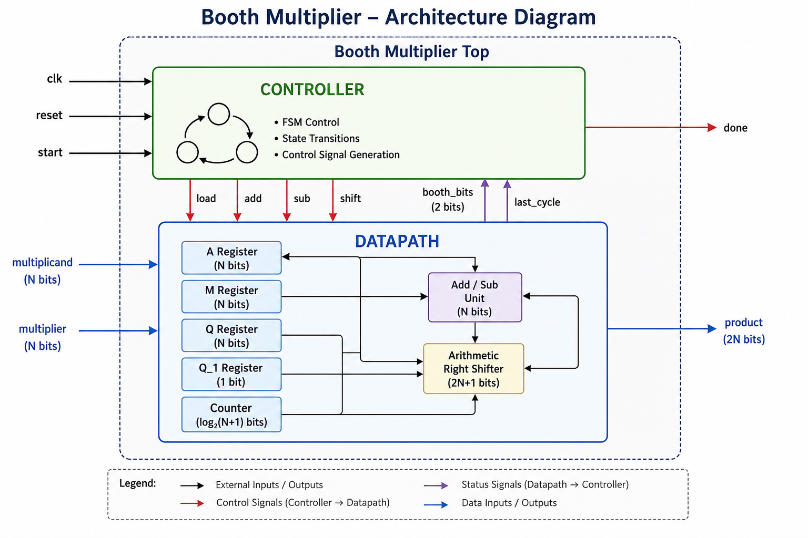
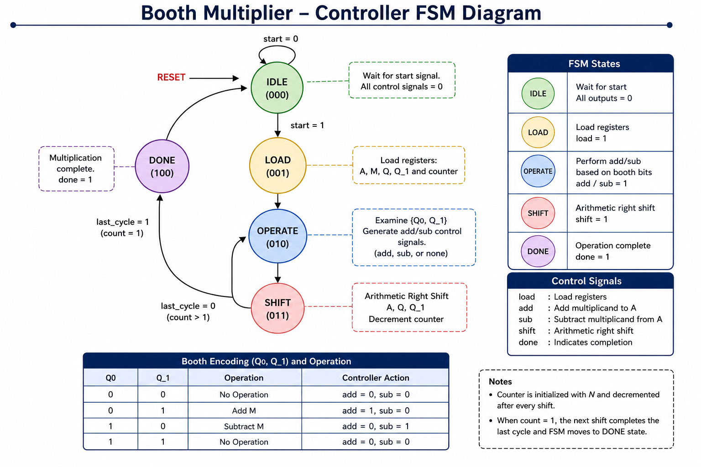
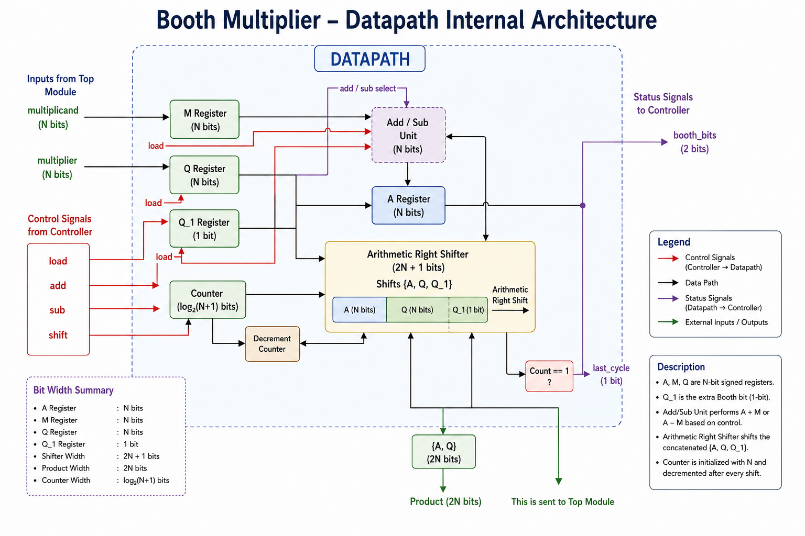
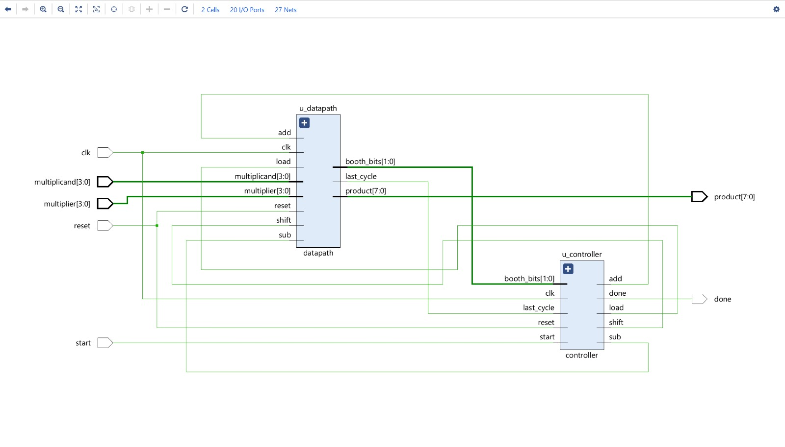
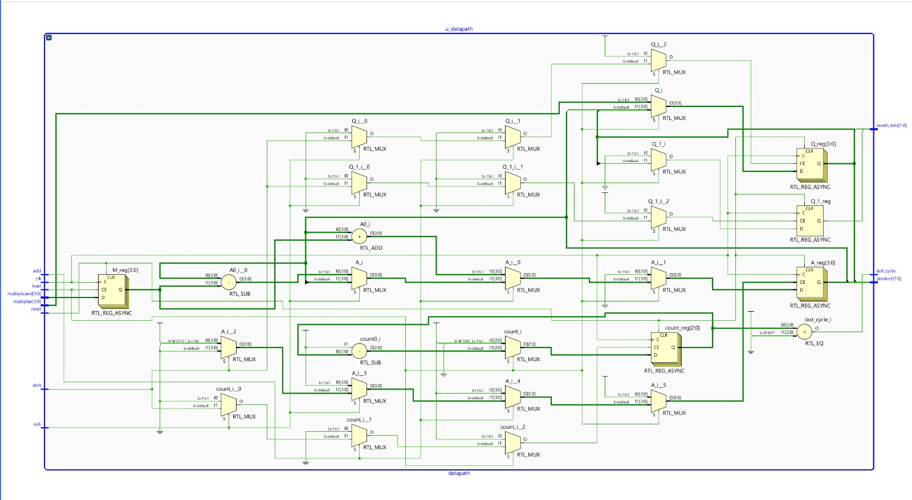
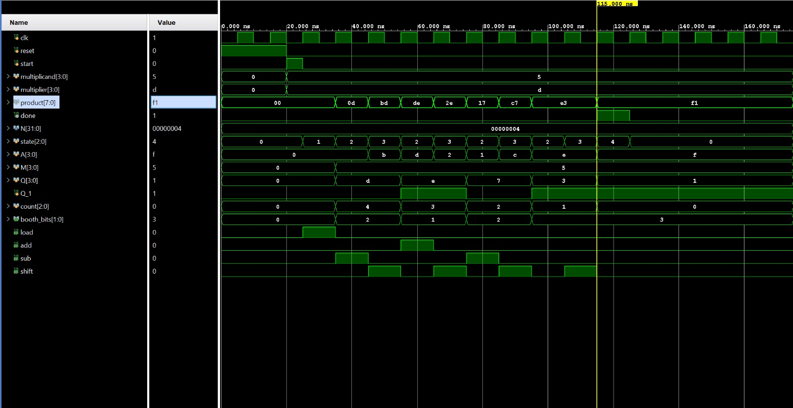

# Booth Multiplier using Verilog HDL

A parameterized signed **Booth Multiplier** implemented in **Verilog HDL** using a **Controller–Datapath architecture**. The design employs a Finite State Machine (FSM) to control Booth's multiplication algorithm and is verified using a self-checking testbench in Xilinx Vivado.

---

# Project Highlights

- Parameterized N-bit signed Booth Multiplier
- Modular Controller–Datapath architecture
- FSM-based controller
- Arithmetic Right Shift implementation
- Booth encoding (Q₀, Q₋₁)
- Synthesizable RTL
- Self-checking Verilog testbench
- Verified using Xilinx Vivado

---

# Repository Structure

```
Booth_Multiplier
│
├── rtl
│   ├── booth_multiplier_top.v
│   ├── controller.v
│   └── datapath.v
│
├── tb
│   └── tb_booth_multiplier.v
│
├── docs
│   ├── Architecture.png
│   ├── Controller_FSM.png
│   ├── Datapath.png
│   ├── Booth_Flowchart.png
│   ├── RTL_Top_Level.png
│   ├── RTL_Datapath.png
│   └── Waveform.png
│
├── README.md
└── LICENSE
```

---

# Project Architecture



The design follows a modular **Controller–Datapath architecture**.

### Controller

Responsible for:

- FSM implementation
- Control signal generation
- Booth decision logic
- Multiplication sequencing

Control signals generated:

- load
- add
- sub
- shift
- done

---

### Datapath

Responsible for:

- Register storage
- Booth arithmetic
- Arithmetic Right Shift
- Counter implementation
- Product generation

Contains:

- A Register
- M Register
- Q Register
- Q₋₁ Register
- Counter
- Add/Sub Unit
- Arithmetic Right Shifter

---

# Controller FSM



The controller consists of five states:

| State | Function |
|--------|----------|
| IDLE | Wait for start signal |
| LOAD | Load registers |
| OPERATE | Perform Booth decision |
| SHIFT | Arithmetic right shift |
| DONE | Multiplication complete |

---

# Datapath



The datapath performs all arithmetic operations while the controller only generates control signals.

---

# Booth Algorithm


Algorithm:

1. Load multiplicand and multiplier.
2. Examine `{Q₀,Q₋₁}`.
3. Add/Subtract if required.
4. Arithmetic Right Shift.
5. Decrement counter.
6. Repeat until count reaches zero.
7. Product = `{A,Q}`.

---

# RTL Schematic

## Top-Level RTL



## Datapath RTL



---

# Simulation Waveform



The waveform demonstrates:

- FSM state transitions
- Booth encoding decisions
- Register updates
- Arithmetic right shifts
- Counter decrement
- Final signed product generation

---

# Verification

The design was verified using a self-checking testbench.

| Multiplicand | Multiplier | Expected Product | Result |
|--------------|------------|------------------|--------|
| 3 | 2 | 6 | PASS |
| 5 | -3 | -15 | PASS |
| -4 | 2 | -8 | PASS |
| -3 | -2 | 6 | PASS |
| 7 | 0 | 0 | PASS |
| 0 | 6 | 0 | PASS |
| 4 | 4 | 16 | PASS |

---

# Tools Used

- Verilog HDL
- Xilinx Vivado
- XSim Simulator
- GitHub

---

# How to Run

1. Open the Vivado project.
2. Add all RTL files from the `rtl` directory.
3. Add the testbench from the `tb` directory.
4. Run Behavioral Simulation.
5. Observe the waveform and verify the output.

---

# Future Improvements

- Radix-4 Booth Multiplier
- Pipelined Booth Multiplier
- Wallace Tree Multiplier
- SystemVerilog/UVM-based verification

---

# Author

**Vadlamani Aditya Madhukesh**

Bachelor of Technology (Electrical and Electronics Engineering)

BITS Pilani,Hyderabad campus
